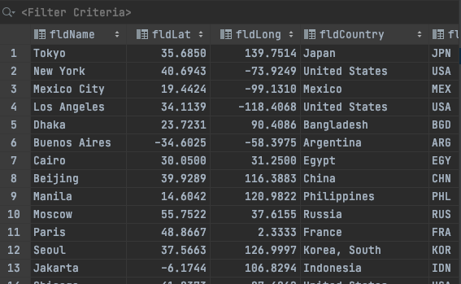
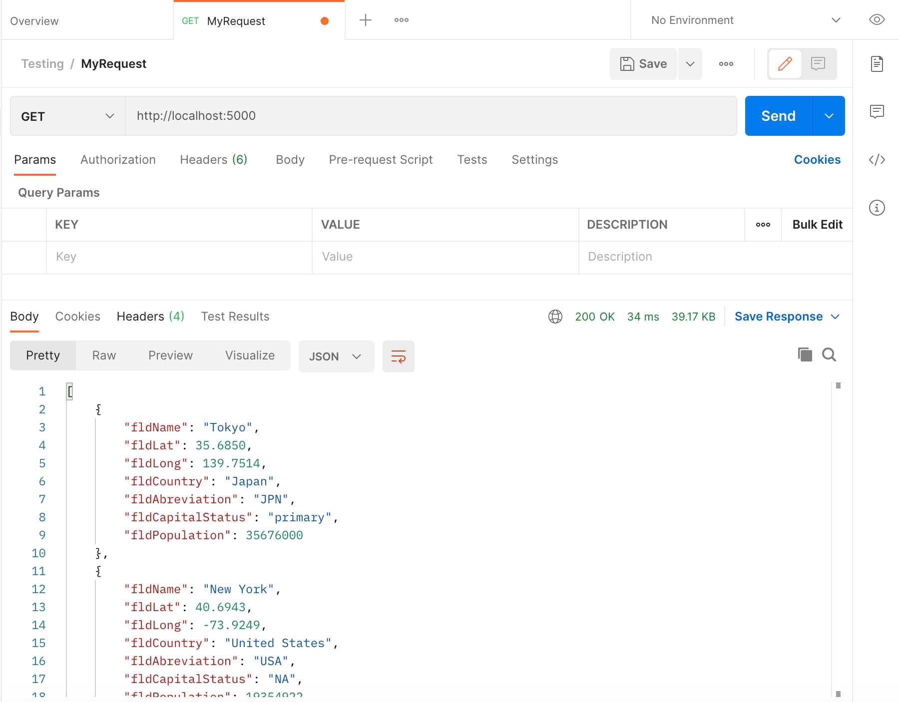
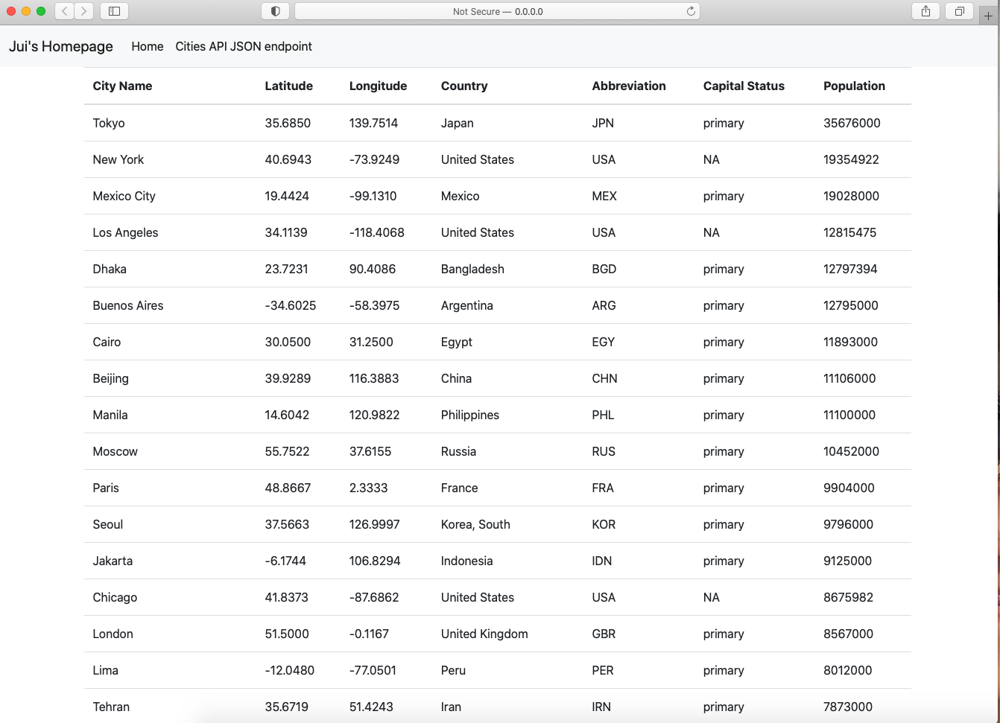

<h1>Project Description</h1>

This project is a homework assignment to teach how to get Pycharm setup with Docker, FLask, MySQL, and Postman.

#SQL Data Screenshot

#Postman screenshot

#IndexPage screenshot
